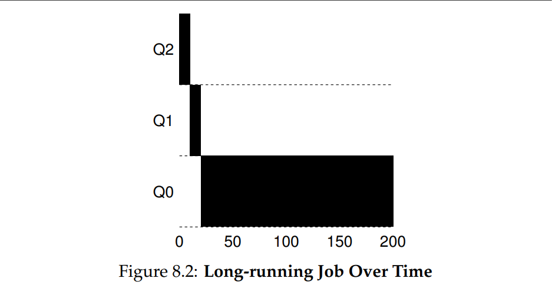
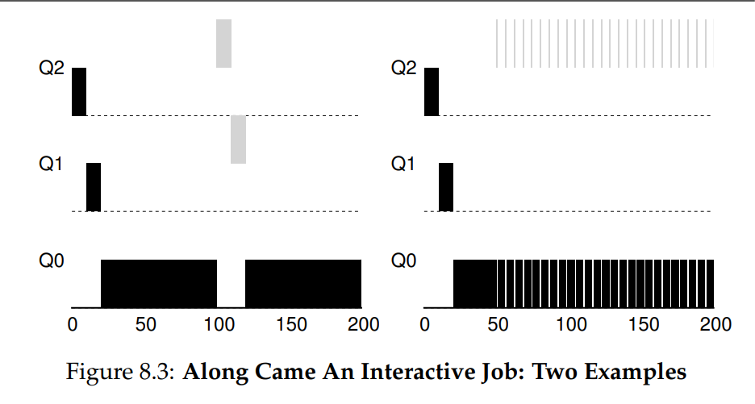
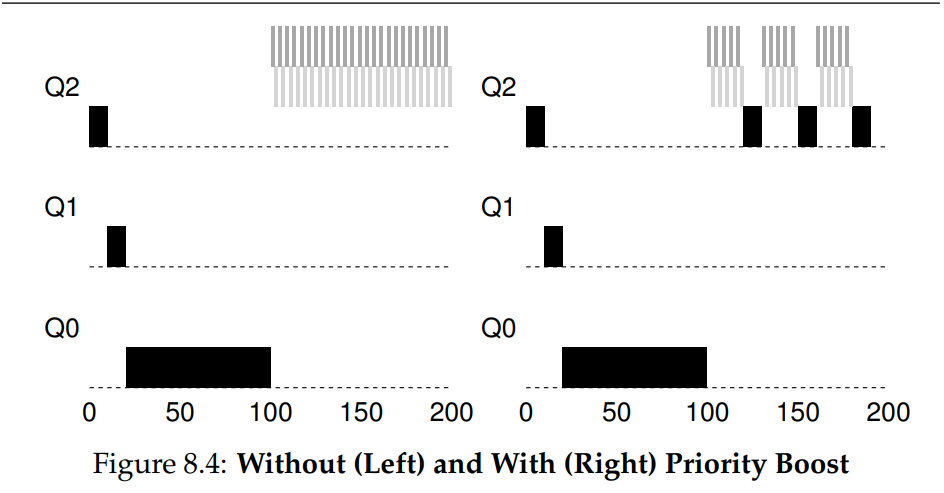
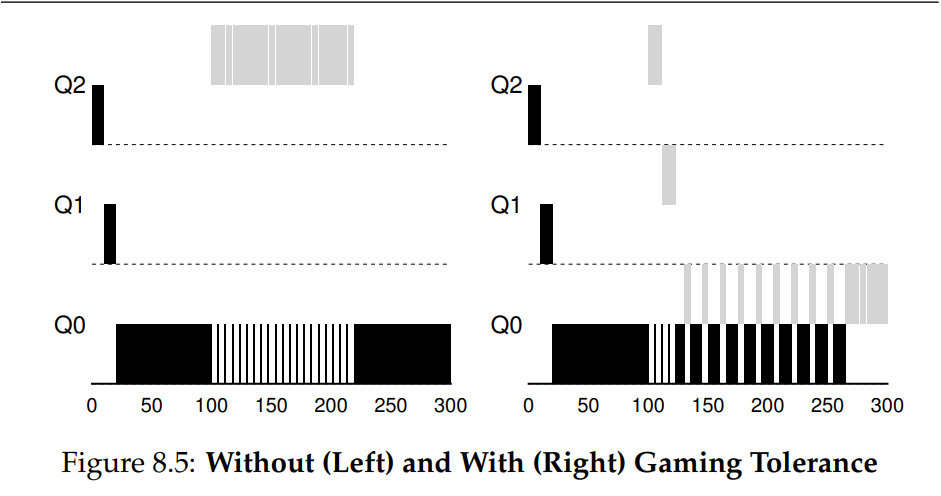
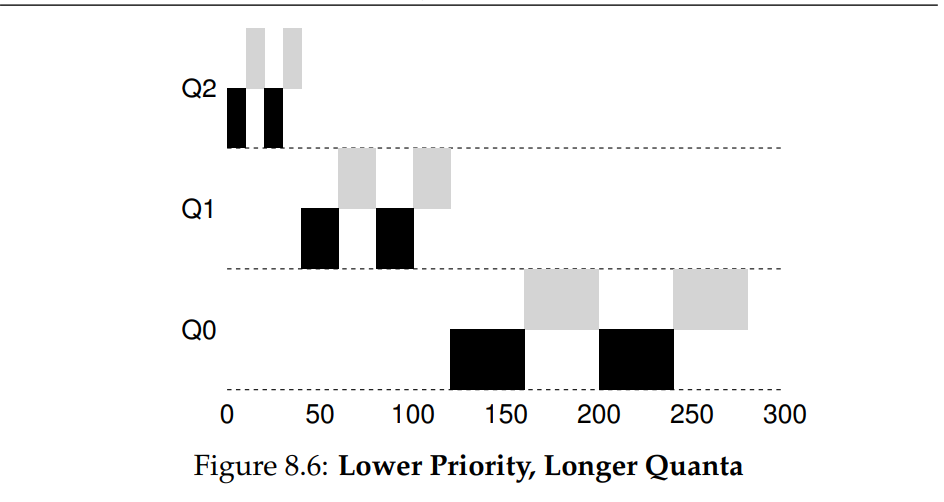

# Actividad de seguimiento - Simulación 2

|Integrante|correo|usuario github|
|---|---|---|
|David Camilo García Echavarría|davidc.garcia@udea.edu.co|davidc-garciae|
|Cristian David Tamayo Espinosa|cristian.tamayoe@udea.edu.co|CrissPr|

## Instrucciones

Antes de empezar a realizar esta actividad haga un **fork** de este repositorio y sobre este trabaje en la solución de las preguntas planteadas en la actividad de simulación. Las respuestas deben ser respondidas en español o si lo prefiere en ingles en el lugar señalado para ello (La palabra **answer** muestra donde).


## Homework (Simulation)

This program, [mlfq.py](mlfq.py), allows you to see how the MLFQ scheduler presented in this chapter behaves. See the [README](https://github.com/remzi-arpacidusseau/ostep-homework/blob/master/cpu-sched-mlfq/README.md) for details.

## Questions

#### 1. Run a few randomly-generated problems with just two jobs and two queues; compute the MLFQ execution trace for each. Make your life easier by limiting the length of each job and turning off I/Os.

  <details>
  <summary>Answer</summary>
  
  ```bash
  !python mlfq.py -j 2 -n 2 -M 0 -s 0 -m 30 -c
  ```

  ```text
  Job List:
    Job  0: startTime   0 - runTime  25 - ioFreq   0
    Job  1: startTime   0 - runTime  13 - ioFreq   0

  Execution Trace:
    ...
    [ time 0 ] Run JOB 0 at PRIORITY 1 [ TICKS 9 ALLOT 1 TIME 24 (of 25) ]
    ...
    [ time 9 ] Run JOB 0 at PRIORITY 1 [ TICKS 0 ALLOT 1 TIME 15 (of 25) ]
    [ time 10 ] Run JOB 1 at PRIORITY 1 [ TICKS 9 ALLOT 1 TIME 12 (of 13) ]
    ...
    [ time 19 ] Run JOB 1 at PRIORITY 1 [ TICKS 0 ALLOT 1 TIME 3 (of 13) ]
    [ time 20 ] Run JOB 0 at PRIORITY 0 [ TICKS 9 ALLOT 1 TIME 14 (of 25) ]
    ...
    [ time 33 ] FINISHED JOB 1
    ...
    [ time 38 ] FINISHED JOB 0

  Final statistics:
    Job  0: startTime   0 - response   0 - turnaround  38
    Job  1: startTime   0 - response  10 - turnaround  33

    Avg  1: startTime n/a - response 5.00 - turnaround 35.50
  ```

  **Explicación:**

  -   `-j 2`: Dos trabajos.
      
  -   `-n 2`: Dos colas.
      
  -   `-m 30`: Limita el tiempo máximo de ejecución de cada trabajo a 30 ms.
      
  -   `-M 0`: Desactiva I/O.
      
  -   `-s <semilla>`: Usa una semilla aleatoria (ej. `-s 1`, `-s 2`, etc.).
      
  -   `-c`: Muestra la solución.

  **Estadísticas Finales:**

  -   **Job 0:**
      -   `response`: 0 (Empezó a ejecutarse inmediatamente al llegar en T=0).
      -   `turnaround`: 38 (Tiempo desde que llegó T=0 hasta que finalizó T=38).
  -   **Job 1:**
      -   `response`: 10 (Llegó en T=0, pero empezó a ejecutarse en T=10).
      -   `turnaround`: 33 (Tiempo desde que llegó T=0 hasta que finalizó T=33).
  -   **Promedios:**
      -   `response`: (0 + 10) / 2 = 5.00 ms
      -   `turnaround`: (38 + 33) / 2 = 35.50 ms

  **Análisis:**

  -   El planificador MLFQ priorizó inicialmente ambos trabajos por igual (Q1).

  -   Job 0, al ejecutarse primero, consumió su tiempo en la cola alta, lo que le dio un excelente tiempo de respuesta (0) pero retrasó el inicio de Job 1.

  -   Ambos trabajos fueron degradados a la cola de baja prioridad (Q0) después de usar su `allotment` inicial.

  -   En la cola baja, se aplicó Round-Robin.

  -   El trabajo más corto (Job 1) terminó antes (T=33 vs T=38), lo cual es un objetivo del MLFQ (aproximar SJF), aunque su tiempo de respuesta fue peor en este caso específico.

  -   La ausencia de I/O y `boost` hace que el comportamiento sea puramente basado en el consumo de CPU y las reglas de descenso de prioridad.
  </details>
  <br>


#### 2. How would you run the scheduler to reproduce each of the examples in the chapter?

  <details>
  <summary>Answer</summary>

  

  Ejemplo 1: **Figura 8.2 (Trabajo largo único):** Un trabajo que consume tiempo y baja de prioridad. 3 colas, quantum 10ms.

  ```bash
  !python mlfq.py -j 1 -n 3 -q 10 --jlist 0,100,0 -c
  ```

  ```text
  Job List:
    Job  0: startTime   0 - runTime 100 - ioFreq   0

  Execution Trace:
    [ time 0 ] JOB BEGINS by JOB 0
    [ time 0 ] Run JOB 0 at PRIORITY 2 [ TICKS 9 ALLOT 1 TIME 99 (of 100) ]
    ...
    [ time 9 ] Run JOB 0 at PRIORITY 2 [ TICKS 0 ALLOT 1 TIME 90 (of 100) ]
    [ time 10 ] Run JOB 0 at PRIORITY 1 [ TICKS 9 ALLOT 1 TIME 89 (of 100) ]
    ...
    [ time 19 ] Run JOB 0 at PRIORITY 1 [ TICKS 0 ALLOT 1 TIME 80 (of 100) ]
    [ time 20 ] Run JOB 0 at PRIORITY 0 [ TICKS 9 ALLOT 1 TIME 79 (of 100) ]
    ...
    [ time 99 ] Run JOB 0 at PRIORITY 0 [ TICKS 0 ALLOT 1 TIME 0 (of 100) ]
    [ time 100 ] FINISHED JOB 0


  Final statistics:
    Job  0: startTime   0 - response   0 - turnaround 100

    Avg  1: startTime n/a - response 0.00 - turnaround 100.00
  ```

  **Análisis:**
  - El trabajo comienza en la cola de mayor prioridad (Q2).
  - Consume su quantum de 10ms y baja a Q1.
  - Consume su quantum de 10ms en Q1 y baja a Q0.
  - Permanece en Q0 hasta que completa su ejecución (80ms restantes), usando quantums de 10ms (Round Robin en Q0).

  

  Ejemplo 2: **Figura 8.3 (Izquierda - Llegada tardía):** Job A largo, Job B corto llega más tarde.

  ```bash
  !python mlfq.py --jlist 0,180,0:100,20,0 -q 10 -c
  ```

  ```text
  Job List:
    Job  0: startTime   0 - runTime 180 - ioFreq   0
    Job  1: startTime 100 - runTime  20 - ioFreq   0

  Execution Trace:
    [ time 0 ] JOB BEGINS by JOB 0
    [ time 0 ] Run JOB 0 at PRIORITY 2 [ TICKS 9 ALLOT 1 TIME 179 (of 180) ]
    ...
    [ time 9 ] Run JOB 0 at PRIORITY 2 [ TICKS 0 ALLOT 1 TIME 170 (of 180) ]
    [ time 10 ] Run JOB 0 at PRIORITY 1 [ TICKS 9 ALLOT 1 TIME 169 (of 180) ]
    ...
    [ time 19 ] Run JOB 0 at PRIORITY 1 [ TICKS 0 ALLOT 1 TIME 160 (of 180) ]
    [ time 20 ] Run JOB 0 at PRIORITY 0 [ TICKS 9 ALLOT 1 TIME 159 (of 180) ]
    ...
    [ time 99 ] Run JOB 0 at PRIORITY 0 [ TICKS 0 ALLOT 1 TIME 80 (of 180) ]
    [ time 100 ] JOB BEGINS by JOB 1
    [ time 100 ] Run JOB 1 at PRIORITY 2 [ TICKS 9 ALLOT 1 TIME 19 (of 20) ]
    ...
    [ time 120 ] FINISHED JOB 1
    ...
    [ time 200 ] FINISHED JOB 0

  Final statistics:
    Job  0: startTime   0 - response   0 - turnaround 200
    Job  1: startTime 100 - response   0 - turnaround  20

    Avg  1: startTime n/a - response 0.00 - turnaround 110.00
  ```

  **Análisis:**
  - Job A corre, baja a Q0. En T=100 llega Job B a Q2.
  - Job B se ejecuta (intercalándose si hay otros trabajos en Q2, pero aquí no) por 2 quantums (20ms) y termina antes de bajar de prioridad.
  - Job A continúa en Q0.
  - MLFQ aproxima SJF dando prioridad alta a B.

  Ejemplo 3: **Figura 8.3 (Derecha - Trabajo con E/S):** Job A largo, Job B interactivo (1ms CPU, luego E/S). Se usa la regla antigua (`-S`) para que B permanezca en alta prioridad.

  ```bash
  !python mlfq.py --jlist 0,180,0:100,20,1 -q 10 -i 5 -S -c
  ```

  ```text
  Job List:
    Job  0: startTime   0 - runTime 180 - ioFreq   0
    Job  1: startTime 100 - runTime  20 - ioFreq   1

  Execution Trace:
    [ time 0 ] JOB BEGINS by JOB 0
    [ time 0 ] Run JOB 0 at PRIORITY 2 [ TICKS 9 ALLOT 1 TIME 179 (of 180) ]
    ...
    [ time 99 ] Run JOB 0 at PRIORITY 0 [ TICKS 0 ALLOT 1 TIME 80 (of 180) ]
    [ time 100 ] JOB BEGINS by JOB 1
    [ time 100 ] Run JOB 1 at PRIORITY 2 [ TICKS 9 ALLOT 1 TIME 19 (of 20) ]
    [ time 101 ] IO_START by JOB 1
    IO DONE
    [ time 101 ] Run JOB 0 at PRIORITY 0 [ TICKS 9 ALLOT 1 TIME 79 (of 180) ]
    ...
    [ time 105 ] Run JOB 0 at PRIORITY 0 [ TICKS 5 ALLOT 1 TIME 75 (of 180) ]
    [ time 106 ] IO_DONE by JOB 1
    [ time 106 ] Run JOB 1 at PRIORITY 2 [ TICKS 9 ALLOT 1 TIME 18 (of 20) ]
    [ time 107 ] IO_START by JOB 1
    IO DONE
    [ time 107 ] Run JOB 0 at PRIORITY 0 [ TICKS 4 ALLOT 1 TIME 74 (of 180) ]
    ...
    [ time 196 ] FINISHED JOB 0
    [ time 196 ] IO_DONE by JOB 1
    [ time 196 ] Run JOB 1 at PRIORITY 2 [ TICKS 9 ALLOT 1 TIME 3 (of 20) ]
    [ time 197 ] IO_START by JOB 1
    IO DONE
    [ time 197 ] IDLE
    ...
    [ time 201 ] IDLE
    [ time 202 ] IO_DONE by JOB 1
    [ time 202 ] Run JOB 1 at PRIORITY 2 [ TICKS 9 ALLOT 1 TIME 2 (of 20) ]
    [ time 203 ] IO_START by JOB 1
    IO DONE
    [ time 203 ] IDLE
    ...
    [ time 215 ] FINISHED JOB 1

  Final statistics:
    Job  0: startTime   0 - response   0 - turnaround 295
    Job  1: startTime 100 - response   0 - turnaround 115

    Avg  1: startTime n/a - response 0.00 - turnaround 205.00
  ```

  **Análisis:**
  - Job A corre y baja a Q0.
  - Llega Job B (T=100) a Q2. Corre 1ms, hace E/S (dura 5ms).
  - Como se usó `-S`, al volver, sigue en Q2. Job A corre mientras B está en E/S.
  - B vuelve y preempta a A. B se mantiene en alta prioridad porque cede la CPU antes de agotar su quantum.
  - Sin `-S`, B bajaría de prioridad después de acumular 10ms de CPU en Q2, independientemente de las E/S.

  

  Ejemplo 4: **Figura 8.4 (Priority Boost):** Izquierda (sin boost, inanición): Job largo (A), 2 interactivos cortos (B, C) llegan y acaparan CPU. Derecha (con boost): Lo mismo, pero con boost cada 100ms.

  *Comando (Sin Boost - Mostrado explícitamente en el notebook):*
  ```bash
  !python mlfq.py --jlist 0,200,0:50,30,1:50,30,1 -q 10 -i 5 -S -c
  ```
  *Comando (Con Boost):*
  ```bash
  !python mlfq.py --jlist 0,200,0:50,30,1:50,30,1 -q 10 -i 5 -b 100 -c
  ```
  ```text
  # Output sin Boost
  Job List:
      Job  0: startTime   0 - runTime 200 - ioFreq   0
      Job  1: startTime  50 - runTime  30 - ioFreq   1
      Job  2: startTime  50 - runTime  30 - ioFreq   1

  Execution Trace:
    [ time 0 ] JOB BEGINS by JOB 0
    [ time 0 ] Run JOB 0 at PRIORITY 2 [ TICKS 9 ALLOT 1 TIME 199 (of 200) ]
    ...
    [ time 50 ] JOB BEGINS by JOB 1
    [ time 50 ] JOB BEGINS by JOB 2
    ...
    [ time 225 ] FINISHED JOB 1
    ...
    [ time 226 ] FINISHED JOB 2
    ...
    [ time 260 ] FINISHED JOB 0

  Final statistics:
    Job  0: startTime   0 - response   0 - turnaround 260
    Job  1: startTime  50 - response   0 - turnaround 175
    Job  2: startTime  50 - response   1 - turnaround 176

    Avg  2: startTime n/a - response 0.33 - turnaround 203.67
  ```

  ```text
  # Output con Boost
  Job List:
    Job  0: startTime   0 - runTime 200 - ioFreq   0
    Job  1: startTime  50 - runTime  30 - ioFreq   1
    Job  2: startTime  50 - runTime  30 - ioFreq   1

  Execution Trace:
    [ time 0 ] JOB BEGINS by JOB 0
    [ time 0 ] Run JOB 0 at PRIORITY 2 [ TICKS 9 ALLOT 1 TIME 199 (of 200) ]
    ...
    [ time 49 ] Run JOB 0 at PRIORITY 0 [ TICKS 0 ALLOT 1 TIME 150 (of 200) ]
    [ time 50 ] JOB BEGINS by JOB 1
    [ time 50 ] JOB BEGINS by JOB 2
    [ time 50 ] Run JOB 1 at PRIORITY 2 [ TICKS 9 ALLOT 1 TIME 29 (of 30) ]
    [ time 51 ] IO_START by JOB 1
    IO DONE
    [ time 51 ] Run JOB 2 at PRIORITY 2 [ TICKS 9 ALLOT 1 TIME 29 (of 30) ]
    [ time 52 ] IO_START by JOB 2
    IO DONE
    [ time 52 ] Run JOB 0 at PRIORITY 0 [ TICKS 9 ALLOT 1 TIME 149 (of 200) ]
    ...
    [ time 56 ] IO_DONE by JOB 1
    [ time 56 ] Run JOB 1 at PRIORITY 2 [ TICKS 8 ALLOT 1 TIME 28 (of 30) ]
    ...
    [ time 100 ] IO_START by JOB 2
    IO DONE
    [ time 100 ] BOOST ( every 100 )
    [ time 100 ] Run JOB 0 at PRIORITY 2 [ TICKS 9 ALLOT 1 TIME 117 (of 200) ]
    ...
    [ time 241 ] FINISHED JOB 1
    ...
    [ time 242 ] FINISHED JOB 2
    ...
    [ time 260 ] FINISHED JOB 0

  Final statistics:
    Job  0: startTime   0 - response   0 - turnaround 260
    Job  1: startTime  50 - response   0 - turnaround 180
    Job  2: startTime  50 - response   1 - turnaround 181

    Avg  1: startTime n/a - response 0.33 - turnaround 207.00
  ```

  **Análisis:**
  - Sin boost, los trabajos interactivos B y C llegan y monopolizan la CPU en Q2, haciendo que A (en Q0) sufra inanición.
  - Con boost (`-b 100`), cada 100ms todos los trabajos son movidos a la cola más alta (Q2).
  - Esto permite que A progrese periódicamente, evitando la inanición completa, aunque los trabajos interactivos siguen teniendo preferencia.

  

  Ejemplo 5: **Figura 8.5 (Gaming the Scheduler):** Izquierda (con gaming): Job B hace E/S justo antes de agotar su quantum para quedarse en Q1. Derecha (sin gaming): Job B baja a Q0.

  *Comando (Con Gaming - Usando `-S`):*
  ```bash
  !python mlfq.py --jlist 0,200,0:1,100,9 -n 2 -q 10 -a 1 -i 1 -S -c
  ```

  ```text
  # Output con Gaming (-S)
  Job List:
    Job  0: startTime   0 - runTime 200 - ioFreq   0
    Job  1: startTime   1 - runTime 100 - ioFreq   9

  Execution Trace:
    [ time 0 ] JOB BEGINS by JOB 0
    [ time 0 ] Run JOB 0 at PRIORITY 2 [ TICKS 9 ALLOT 1 TIME 199 (of 200) ]
    [ time 1 ] JOB BEGINS by JOB 1
    ...
    [ time 9 ] Run JOB 0 at PRIORITY 1 [ TICKS 0 ALLOT 1 TIME 190 (of 200) ]
    [ time 10 ] Run JOB 1 at PRIORITY 1 [ TICKS 9 ALLOT 1 TIME 99 (of 100) ]
    ...
    [ time 18 ] Run JOB 1 at PRIORITY 1 [ TICKS 1 ALLOT 1 TIME 91 (of 100) ]
    [ time 19 ] IO_START by JOB 1
    IO DONE
    [ time 19 ] Run JOB 0 at PRIORITY 0 [ TICKS 9 ALLOT 1 TIME 189 (of 200) ]
    [ time 20 ] IO_DONE by JOB 1
    [ time 20 ] Run JOB 1 at PRIORITY 1 [ TICKS 9 ALLOT 1 TIME 90 (of 100) ]
    ...
    [ time 121 ] FINISHED JOB 1
    [ time 121 ] Run JOB 0 at PRIORITY 0 [ TICKS 8 ALLOT 1 TIME 178 (of 200) ]
    ...
    [ time 300 ] FINISHED JOB 0

  Final statistics:
    Job  0: startTime   0 - response   0 - turnaround 300
    Job  1: startTime   1 - response   9 - turnaround 120

    Avg  1: startTime n/a - response 4.50 - turnaround 210.00
  ```

  *Comando (Sin Gaming - Sin `-S`):*
  ```bash
  !python mlfq.py --jlist 0,200,0:1,100,9 -n 2 -q 10 -a 1 -i 1 -c
  ```
  ```text
  # Output sin Gaming 
  Job List:
    Job  0: startTime   0 - runTime 200 - ioFreq   0
    Job  1: startTime   1 - runTime 100 - ioFreq   9

  Execution Trace:
    [ time 0 ] JOB BEGINS by JOB 0
    [ time 0 ] Run JOB 0 at PRIORITY 1 [ TICKS 9 ALLOT 1 TIME 199 (of 200) ]
    [ time 1 ] JOB BEGINS by JOB 1
    ...
    [ time 9 ] Run JOB 0 at PRIORITY 1 [ TICKS 0 ALLOT 1 TIME 190 (of 200) ]
    [ time 10 ] Run JOB 1 at PRIORITY 1 [ TICKS 9 ALLOT 1 TIME 99 (of 100) ]
    ...
    [ time 19 ] IO_START by JOB 1
    IO DONE
    [ time 19 ] Run JOB 0 at PRIORITY 0 [ TICKS 9 ALLOT 1 TIME 189 (of 200) ]
    [ time 20 ] IO_DONE by JOB 1
    [ time 20 ] Run JOB 1 at PRIORITY 1 [ TICKS 0 ALLOT 1 TIME 90 (of 100) ]
    [ time 21 ] Run JOB 0 at PRIORITY 0 [ TICKS 8 ALLOT 1 TIME 188 (of 200) ]
    ...
    [ time 290 ] FINISHED JOB 1
    ...
    [ time 300 ] FINISHED JOB 0    

  Final statistics:
    Job  0: startTime   0 - response   0 - turnaround 300
    Job  1: startTime   1 - response   9 - turnaround 289

    Avg  1: startTime n/a - response 4.50 - turnaround 294.50
  ```


  **Análisis:**
  - Con `-S` (regla antigua), Job B corre 9ms en Q1, hace E/S (1ms), vuelve a Q1 con allotment reseteado. Repite esto, monopolizando casi toda la CPU mientras está activo, dejando a A correr solo durante la E/S de B.
  - Sin `-S` (regla moderna), la cuenta del tiempo de CPU de B en Q1 se acumula. Después de usar 10ms en total en Q1 (p.ej., 9ms + 1ms tras volver de E/S), B baja a Q0, permitiendo una distribución más justa.

  

  Ejemplo 6: **Figura 8.6 (Quantums y Allotments distintos):** Usar `-Q` y `-A` para configurar tiempos por cola.

  ```bash
  !python mlfq.py -j 2 -m 200 -M 0 -Q 10,20,40 -A 2,2,1 -c
  ```

  ```text
  Job List:
    Job  0: startTime   0 - runTime 169 - ioFreq   0
    Job  1: startTime   0 - runTime  84 - ioFreq   0

  Execution Trace:
     time 0 ] JOB BEGINS by JOB 0
    [ time 0 ] JOB BEGINS by JOB 1
    [ time 0 ] Run JOB 0 at PRIORITY 2 [ TICKS 9 ALLOT 2 TIME 168 (of 169) ]
    ...
    [ time 9 ] Run JOB 0 at PRIORITY 2 [ TICKS 0 ALLOT 2 TIME 159 (of 169) ]
    [ time 10 ] Run JOB 1 at PRIORITY 2 [ TICKS 9 ALLOT 2 TIME 83 (of 84) ]
    ...
    [ time 20 ] Run JOB 0 at PRIORITY 2 [ TICKS 9 ALLOT 1 TIME 158 (of 169) ]
    ...
    [ time 30 ] Run JOB 1 at PRIORITY 2 [ TICKS 9 ALLOT 1 TIME 73 (of 84) ]
    ...
    [ time 40 ] Run JOB 0 at PRIORITY 1 [ TICKS 19 ALLOT 2 TIME 148 (of 169) ]
    ...
    [ time 60 ] Run JOB 1 at PRIORITY 1 [ TICKS 19 ALLOT 2 TIME 63 (of 84) ]
    ...
    [ time 80 ] Run JOB 0 at PRIORITY 1 [ TICKS 19 ALLOT 1 TIME 128 (of 169) ]
    ...
    [ time 100 ] Run JOB 1 at PRIORITY 1 [ TICKS 19 ALLOT 1 TIME 43 (of 84) ]
    ...
    [ time 120 ] Run JOB 0 at PRIORITY 0 [ TICKS 39 ALLOT 1 TIME 108 (of 169) ]
    ...
    [ time 160 ] Run JOB 1 at PRIORITY 0 [ TICKS 39 ALLOT 1 TIME 23 (of 84) ]
    ...
    [ time 184 ] FINISHED JOB 1
    ...
    [ time 253 ] FINISHED JOB 0

  Final statistics:
    Job  0: startTime   0 - response   0 - turnaround 253
    Job  1: startTime   0 - response  10 - turnaround 184

    Avg  1: startTime n/a - response 5.00 - turnaround 218.50
  ```

  **Análisis:**
  - `-Q 10,20,40`: Quantum de Q2=10ms, Q1=20ms, Q0=40ms.
  - `-A 2,2,1`: Allotment (en slices) de Q2=2, Q1=2, Q0=1.
  - Tiempo total antes de bajar: Q2 = 2 * 10 = 20ms; Q1 = 2 * 20 = 40ms; Q0 = 1 * 40 = 40ms (luego RR en Q0).
  - Los trabajos permanecen más tiempo en las colas antes de bajar: 20ms en Q2, 40ms en Q1.
  - En Q0, se alternan en bloques de 40ms.
  </details>
  <br>


#### 3. How would you configure the scheduler parameters to behave just like a round-robin scheduler?

  <details>
  <summary>Answer</summary>

  ```bash
  !python mlfq.py -n 1 -q 10 -a 1000 -B 0 --jlist "0,50,0:10,50,0" -c
  ```

  ```text
  Job List:
    Job  0: startTime   0 - runTime  50 - ioFreq   0
    Job  1: startTime  10 - runTime  50 - ioFreq   0

  Execution Trace:
    ...
    [ time 9 ] Run JOB 0 at PRIORITY 0 [ TICKS 0 ALLOT 1000 TIME 40 (of 50) ]
    [ time 10 ] JOB BEGINS by JOB 1
    [ time 10 ] Run JOB 0 at PRIORITY 0 [ TICKS 9 ALLOT 999 TIME 39 (of 50) ]
    ...
    [ time 20 ] Run JOB 1 at PRIORITY 0 [ TICKS 9 ALLOT 1000 TIME 49 (of 50) ]
    ...
    [ time 30 ] Run JOB 0 at PRIORITY 0 [ TICKS 9 ALLOT 998 TIME 29 (of 50) ]
    ...
    [ time 80 ] FINISHED JOB 0
    ...
    [ time 100 ] FINISHED JOB 1

  Final statistics:
    Job  0: startTime   0 - response   0 - turnaround  80
    Job  1: startTime  10 - response  10 - turnaround  90

    Avg  1: startTime n/a - response 5.00 - turnaround 85.00
  ```

  **Explicación:**
      
  -   `-n 1`: Una sola cola.
      
  -   `-q 10`: Quantum de 10 ms.
      
  -   `-a 1000`: Allotment muy alto para evitar cambios de prioridad.
      
  -   `-B 0`: Sin priority boost.
      
  -   `--jlist "0,50,0:10,50,0"`: Dos trabajos de 50 ms sin E/S.
          

  **Análisis:**

  -   Todos los trabajos permanecen en la misma cola y se alternan cada 10 ms (RR).
      
  -   Sin cambios de prioridad ni boosts, el comportamiento es idéntico a Round Robin.
  </details>
  <br>

#### 4. Craft a workload with two jobs and scheduler parameters so that one job takes advantage of the older Rules 4a and 4b (turned on with the -S flag) to game the scheduler and obtain 99% of the CPU over a particular time interval.

  <details>
  <summary>Answer</summary>

  ```bash
  !python mlfq.py --jlist 0,1000,0:1,1000,99 -n 2 -q 100 -a 1 -i 1 -S -c
  ```

  ```text
  Job List:
    Job  0: startTime   0 - runTime 1000 - ioFreq   0
    Job  1: startTime   1 - runTime 1000 - ioFreq  99

  Execution Trace:
    ...
    [ time 1 ] JOB BEGINS by JOB 1
    [ time 1 ] Run JOB 0 at PRIORITY 1 [ TICKS 98 ALLOT 1 TIME 998 (of 1000) ]
    ...
    [ time 99 ] Run JOB 0 at PRIORITY 1 [ TICKS 0 ALLOT 1 TIME 900 (of 1000) ]
    [ time 100 ] Run JOB 1 at PRIORITY 1 [ TICKS 99 ALLOT 1 TIME 999 (of 1000) ]
    ...
    [ time 198 ] Run JOB 1 at PRIORITY 1 [ TICKS 1 ALLOT 1 TIME 901 (of 1000) ]
    [ time 199 ] IO_START by JOB 1
    IO DONE
    [ time 199 ] Run JOB 0 at PRIORITY 0 [ TICKS 99 ALLOT 1 TIME 899 (of 1000) ]
    [ time 200 ] IO_DONE by JOB 1
    [ time 200 ] Run JOB 1 at PRIORITY 1 [ TICKS 99 ALLOT 1 TIME 900 (of 1000) ]
    ...
    [ time 298 ] Run JOB 1 at PRIORITY 1 [ TICKS 1 ALLOT 1 TIME 802 (of 1000) ]
    [ time 299 ] IO_START by JOB 1
    IO DONE
    [ time 299 ] Run JOB 0 at PRIORITY 0 [ TICKS 98 ALLOT 1 TIME 898 (of 1000) ]
    [ time 300 ] IO_DONE by JOB 1
    [ time 300 ] Run JOB 1 at PRIORITY 1 [ TICKS 99 ALLOT 1 TIME 801 (of 1000) ]
    ...
    [ time 1110 ] FINISHED JOB 1
    ...
    [ time 2000 ] FINISHED JOB 0

  Final statistics:
    Job  0: startTime   0 - response   0 - turnaround 2000
    Job  1: startTime   1 - response  99 - turnaround 1109

    Avg  1: startTime n/a - response 49.50 - turnaround 1554.50
  ```

  **Análisis:**

  -   Job A empieza y baja rápidamente a la cola Q0.

  -   Job B llega (T=1) a la cola Q1 (la más alta).

  -   Job B se ejecuta por 99ms. Justo antes de agotar su quantum/allotment de 100ms, realiza una E/S (que dura 1ms).

  -   Debido a `-S`, cuando Job B termina su E/S, regresa a la cola Q1 (la más alta) con su allotment reseteado.

  -   Job A solo se ejecuta durante el breve tiempo (1ms) que Job B está realizando la E/S.

  -   Job B se ejecuta durante 99ms de cada ciclo de 100ms (99ms CPU + 1ms E/S). Por lo tanto, Job B obtiene el 99% de la CPU mientras está activo y compite con A. Calcula el uso de CPU en la traza para un intervalo largo (p.ej., de T=1 a T=1001) para confirmarlo.
  </details>
  <br>

#### 5. Given a system with a quantum length of 10 ms in its highest queue, how often would you have to boost jobs back to the highest priority level (with the `-B` flag) in order to guarantee that a single longrunning (and potentially-starving) job gets at least 5% of the CPU?

  <details>
  <summary>Answer</summary>

  ```bash
  !python mlfq.py --jlist 0,1000,0:1,30,1:1,30,1:1,30,1:1,30,1:1,30,1 -q 10 -i 1 -B 200 -c
  ```

  ```text
  Job List:
    Job  0: startTime   0 - runTime 1000 - ioFreq   0
    Job  1: startTime   1 - runTime  30 - ioFreq   1
    Job  2: startTime   1 - runTime  30 - ioFreq   1
    Job  3: startTime   1 - runTime  30 - ioFreq   1
    Job  4: startTime   1 - runTime  30 - ioFreq   1
    Job  5: startTime   1 - runTime  30 - ioFreq   1

  Execution Trace:
    [ time 0 ] JOB BEGINS by JOB 0
    ...
    [ time 1 ] Run JOB 0 at PRIORITY 2 [ TICKS 8 ALLOT 1 TIME 998 (of 1000) ]
    ...
    [ time 10 ] Run JOB 1 at PRIORITY 2 [ TICKS 9 ALLOT 1 TIME 29 (of 30) ]
    [ time 11 ] IO_START by JOB 1
    IO DONE
    [ time 11 ] Run JOB 2 at PRIORITY 2 [ TICKS 9 ALLOT 1 TIME 29 (of 30) ]
    [ time 12 ] IO_START by JOB 2
    IO DONE
    ...
    [ time 60 ] IO_DONE by JOB 4
    [ time 60 ] Run JOB 0 at PRIORITY 1 [ TICKS 9 ALLOT 1 TIME 989 (of 1000) ]
    [ time 61 ] IO_DONE by JOB 5
    [ time 61 ] Run JOB 0 at PRIORITY 1 [ TICKS 8 ALLOT 1 TIME 988 (of 1000) ]
    ...
    [ time 69 ] Run JOB 0 at PRIORITY 1 [ TICKS 0 ALLOT 1 TIME 980 (of 1000) ]
    [ time 70 ] Run JOB 1 at PRIORITY 1 [ TICKS 9 ALLOT 1 TIME 19 (of 30) ]
    ...
    [ time 196 ] IO_DONE by JOB 5
    [ time 196 ] Run JOB 0 at PRIORITY 0 [ TICKS 8 ALLOT 1 TIME 928 (of 1000) ]
    ...
    [ time 199 ] Run JOB 0 at PRIORITY 0 [ TICKS 5 ALLOT 1 TIME 925 (of 1000) ]
    [ time 200 ] BOOST ( every 200 )
    [ time 200 ] Run JOB 0 at PRIORITY 2 [ TICKS 9 ALLOT 1 TIME 924 (of 1000) ]
    ...
      
    [ time 230 ] FINISHED JOB 1


  Final statistics:
    Job  0: startTime   0 - response   0 - turnaround 1150
    Job  1: startTime   1 - response   9 - turnaround 230
    Job  2: startTime   1 - response  10 - turnaround 231
    Job  3: startTime   1 - response  11 - turnaround 232
    Job  4: startTime   1 - response  12 - turnaround 233
    Job  5: startTime   1 - response  13 - turnaround 234

    Avg  5: startTime n/a - response 9.17 - turnaround 385.00
  ```

  **Análisis y Cálculo:**

  -   El objetivo es que el trabajo largo obtenga al menos el 5% (o 0.05) de la CPU.
  -   El quantum en la cola más alta es de 10 ms.
  -   Cuando ocurre un `boost` (cada `S` milisegundos, donde `S` es el valor de `-B`), el trabajo largo es movido a la cola más alta.
  -   En el peor de los casos (muchos otros trabajos también son impulsados a la cola más alta), el trabajo largo obtendrá al menos _un_ quantum completo (10 ms) en la cola más alta inmediatamente después del boost, gracias al Round-Robin dentro de esa cola.
  -   Para garantizar un 5% de CPU, este trabajo debe recibir sus 10 ms de ejecución dentro de un intervalo de tiempo `S` tal que `(tiempo de ejecución / intervalo total) >= 0.05`.
  -   Es decir: `10 ms / S >= 0.05`.
  -   Resolviendo para `S`: `S <= 10 ms / 0.05`.
  -   `S <= 200 ms`.
  -   Por lo tanto, necesitas realizar un `priority boost` (`-B`) **cada 200 milisegundos o menos** para garantizar que el trabajo largo obtenga al menos el 5% de la CPU. Ejecuta la simulación con `-B 200` y verifica en la traza que el Job 0 se ejecuta periódicamente. Podrías necesitar una simulación más larga (`-m` grande para el Job 0, o aumentar el tiempo total simulado si hubiera opción) para observar el porcentaje a largo plazo.
  </details>
  <br>

#### 6. One question that arises in scheduling is which end of a queue to add a job that just finished I/O; the -I flag changes this behavior for this scheduling simulator. Play around with some workloads and see if you can see the effect of this flag.

  <details>
  <summary>Answer</summary>

  **Comando con -I:**
  ```bash
  !python mlfq.py --jlist "0,50,5:10,50,5" -I -c
  ```

  ```text
  Job List:
    Job  0: startTime   0 - runTime  50 - ioFreq   5
    Job  1: startTime  10 - runTime  50 - ioFreq   5
  ...

  Final statistics:
    Job  0: startTime   0 - response   0 - turnaround  95
    Job  1: startTime  10 - response   5 - turnaround 100

    Avg  1: startTime n/a - response 2.50 - turnaround 97.50
  ```

  **Comando sin -I:**
  ```bash
  !python mlfq.py --jlist "0,50,5:10,50,5" -c
  ```

  ```text
  Job List:
    Job  0: startTime   0 - runTime  50 - ioFreq   5
    Job  1: startTime  10 - runTime  50 - ioFreq   5
  ...

  Final statistics:
    Job  0: startTime   0 - response   0 - turnaround 100
    Job  1: startTime  10 - response   0 - turnaround  95

    Avg  1: startTime n/a - response 0.00 - turnaround 97.50
  ```

  **Análisis:**

  -   Con `-I`, los trabajos que completan E/S se ejecutan inmediatamente.
      
  -   Sin `-I`, los trabajos esperan su turno en la cola actual.
      
  -   Ejemplo: Si el trabajo A hace E/S, con `-I` retoma rápidamente; sin `-I`, espera detrás de otros en la misma cola.
  </details>
  <br>

